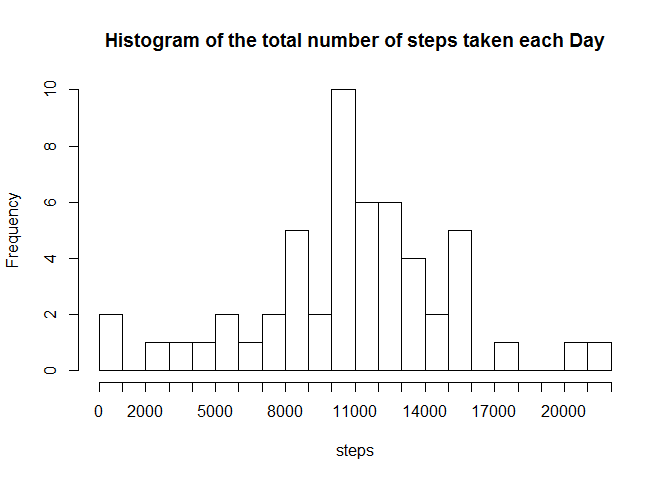
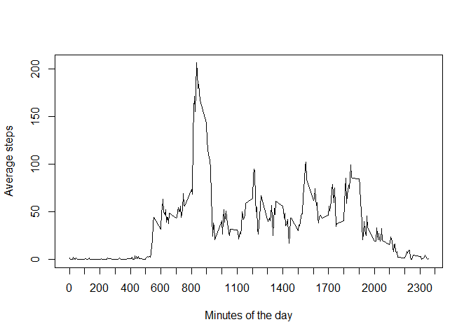

# Reproducible Research: Peer Assessment 1


## Loading and preprocessing the data

```r
# The data is read from the zip file and saved into a variable after processing the CSV file
activitymonitoringdataconnection <- unz("activity.zip", "activity.csv")
activitymonitoringdata <- read.csv(activitymonitoringdataconnection, sep=",", head = TRUE)
```


## 1. What is mean total number of steps taken per day?
## 1.1 Total number of steps taken per day

```r
activitymonitoringdataflag <- cbind( activitymonitoringdata, !is.na(activitymonitoringdata$steps))
colnames(activitymonitoringdataflag)[4] <- "flag"
activitymonitoringdataexNA <- activitymonitoringdataflag[activitymonitoringdataflag$flag == TRUE,]
activitymonitoringdataexNAtoAgg <- cbind(data.frame(cbind(activitymonitoringdataexNA$steps)), activitymonitoringdataexNA$date)
colnames(activitymonitoringdataexNAtoAgg) <- c("steps", "date")

activitymonitoringdataexNAsum <- aggregate(as.numeric(activitymonitoringdataexNAtoAgg$steps), by = list(activitymonitoringdataexNAtoAgg[,"date"]), FUN = sum, na.rm = TRUE)
colnames(activitymonitoringdataexNAsum) <- c("date", "Number of steps")
activitymonitoringdataexNAsum
```

```
##          date Number of steps
## 1  2012-10-02             126
## 2  2012-10-03           11352
## 3  2012-10-04           12116
## 4  2012-10-05           13294
## 5  2012-10-06           15420
## 6  2012-10-07           11015
## 7  2012-10-09           12811
## 8  2012-10-10            9900
## 9  2012-10-11           10304
## 10 2012-10-12           17382
## 11 2012-10-13           12426
## 12 2012-10-14           15098
## 13 2012-10-15           10139
## 14 2012-10-16           15084
## 15 2012-10-17           13452
## 16 2012-10-18           10056
## 17 2012-10-19           11829
## 18 2012-10-20           10395
## 19 2012-10-21            8821
## 20 2012-10-22           13460
## 21 2012-10-23            8918
## 22 2012-10-24            8355
## 23 2012-10-25            2492
## 24 2012-10-26            6778
## 25 2012-10-27           10119
## 26 2012-10-28           11458
## 27 2012-10-29            5018
## 28 2012-10-30            9819
## 29 2012-10-31           15414
## 30 2012-11-02           10600
## 31 2012-11-03           10571
## 32 2012-11-05           10439
## 33 2012-11-06            8334
## 34 2012-11-07           12883
## 35 2012-11-08            3219
## 36 2012-11-11           12608
## 37 2012-11-12           10765
## 38 2012-11-13            7336
## 39 2012-11-15              41
## 40 2012-11-16            5441
## 41 2012-11-17           14339
## 42 2012-11-18           15110
## 43 2012-11-19            8841
## 44 2012-11-20            4472
## 45 2012-11-21           12787
## 46 2012-11-22           20427
## 47 2012-11-23           21194
## 48 2012-11-24           14478
## 49 2012-11-25           11834
## 50 2012-11-26           11162
## 51 2012-11-27           13646
## 52 2012-11-28           10183
## 53 2012-11-29            7047
```
## 1.2 Histogram of the total number of steps taken each day

```r
hist(activitymonitoringdataexNAsum$'Number of steps', 
      main = "Histogram of the total number of steps taken each Day",
      breaks = 20,
      xlab = "steps",
      xaxt = 'n')
axis(1, at = seq(0,22000, by = 1000), labels = seq(0,22000, by = 1000) )
```

 
## 1.3 Mean and Median of the total number of steps taken per day

```r
activitymonitoringdataexNAMean <- aggregate(activitymonitoringdataexNAtoAgg$steps, by = list(activitymonitoringdataexNAtoAgg[,"date"]), FUN =  mean, na.rm = TRUE)
colnames(activitymonitoringdataexNAMean) <- c("Date", "Mean of Steps")
activitymonitoringdataexNAMedian <- aggregate(activitymonitoringdataexNAtoAgg$steps, by = list(activitymonitoringdataexNAtoAgg[,"date"]), FUN = median, na.rm = TRUE)
colnames(activitymonitoringdataexNAMedian) <- c("Date", "Median of Steps")
activitymonitoringdataMeanMedian <- merge(activitymonitoringdataexNAMean,activitymonitoringdataexNAMedian, by = 'Date' )
colnames(activitymonitoringdataMeanMedian) <- c("Date", "Mean Steps", "Median Steps")
activitymonitoringdataMeanMedian
```

```
##          Date Mean Steps Median Steps
## 1  2012-10-02  0.4375000            0
## 2  2012-10-03 39.4166667            0
## 3  2012-10-04 42.0694444            0
## 4  2012-10-05 46.1597222            0
## 5  2012-10-06 53.5416667            0
## 6  2012-10-07 38.2465278            0
## 7  2012-10-09 44.4826389            0
## 8  2012-10-10 34.3750000            0
## 9  2012-10-11 35.7777778            0
## 10 2012-10-12 60.3541667            0
## 11 2012-10-13 43.1458333            0
## 12 2012-10-14 52.4236111            0
## 13 2012-10-15 35.2048611            0
## 14 2012-10-16 52.3750000            0
## 15 2012-10-17 46.7083333            0
## 16 2012-10-18 34.9166667            0
## 17 2012-10-19 41.0729167            0
## 18 2012-10-20 36.0937500            0
## 19 2012-10-21 30.6284722            0
## 20 2012-10-22 46.7361111            0
## 21 2012-10-23 30.9652778            0
## 22 2012-10-24 29.0104167            0
## 23 2012-10-25  8.6527778            0
## 24 2012-10-26 23.5347222            0
## 25 2012-10-27 35.1354167            0
## 26 2012-10-28 39.7847222            0
## 27 2012-10-29 17.4236111            0
## 28 2012-10-30 34.0937500            0
## 29 2012-10-31 53.5208333            0
## 30 2012-11-02 36.8055556            0
## 31 2012-11-03 36.7048611            0
## 32 2012-11-05 36.2465278            0
## 33 2012-11-06 28.9375000            0
## 34 2012-11-07 44.7326389            0
## 35 2012-11-08 11.1770833            0
## 36 2012-11-11 43.7777778            0
## 37 2012-11-12 37.3784722            0
## 38 2012-11-13 25.4722222            0
## 39 2012-11-15  0.1423611            0
## 40 2012-11-16 18.8923611            0
## 41 2012-11-17 49.7881944            0
## 42 2012-11-18 52.4652778            0
## 43 2012-11-19 30.6979167            0
## 44 2012-11-20 15.5277778            0
## 45 2012-11-21 44.3993056            0
## 46 2012-11-22 70.9270833            0
## 47 2012-11-23 73.5902778            0
## 48 2012-11-24 50.2708333            0
## 49 2012-11-25 41.0902778            0
## 50 2012-11-26 38.7569444            0
## 51 2012-11-27 47.3819444            0
## 52 2012-11-28 35.3576389            0
## 53 2012-11-29 24.4687500            0
```

## 2. What is the average daily activity pattern?


```r
activitymonitoringdataflag <- cbind( activitymonitoringdata, !is.na(activitymonitoringdata$steps))
colnames(activitymonitoringdataflag)[4] <- "flag"
activitymonitoringdataexNA <- activitymonitoringdataflag[activitymonitoringdataflag$flag == TRUE,]
activitymonitoringdataexNAtoAgg2 <- cbind(data.frame(cbind(activitymonitoringdataexNA$steps)), activitymonitoringdataexNA$interval)
colnames(activitymonitoringdataexNAtoAgg2) <- c("steps", "interval")
activitymonitoringdataexNAavg2 <- aggregate(as.numeric(activitymonitoringdataexNAtoAgg2$steps), by = list(activitymonitoringdataexNAtoAgg2[,"interval"]), FUN = mean, na.rm = TRUE)
colnames(activitymonitoringdataexNAavg2) <- c("interval", "average_steps")

plot(activitymonitoringdataexNAavg2$interval,
     as.numeric(activitymonitoringdataexNAavg2$average_steps),
     type = 'l',
     xlab = "Minutes of the day",
     ylab = "Average steps",
     xaxt = 'n')
axis(1, at = seq(0,2400, by = 100), labels = seq(0,2400, by = 100))
```

 

```r
activitymonitoringdataexNAavg2order <- activitymonitoringdataexNAavg2[order(-activitymonitoringdataexNAavg2$average_steps),]
activitymonitoringdataexNAavg2order$interval[1]
```

```
## [1] 835
```


## Imputing missing values


## Are there differences in activity patterns between weekdays and weekends?
