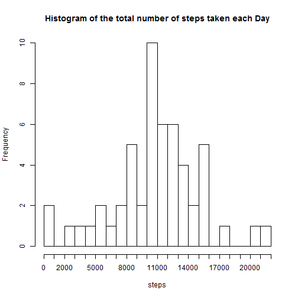

## Loading and preprocessing the data

```r
# The data is read from the zip file and saved into a variable after processing the CSV file
activitymonitoringdataconnection <- unz("activity.zip", "activity.csv")
activitymonitoringdata <- read.csv(activitymonitoringdataconnection, sep=",", head = TRUE)
```


## 1. What is mean total number of steps taken per day?
## 1.1 Total number of steps taken per day

```r
activitymonitoringdataflag <- cbind( activitymonitoringdata, !is.na(activitymonitoringdata$steps))
colnames(activitymonitoringdataflag)[4] <- "flag"
activitymonitoringdataexNA <- activitymonitoringdataflag[activitymonitoringdataflag$flag == TRUE,]
activitymonitoringdataexNAtoAgg <- cbind(data.frame(cbind(activitymonitoringdataexNA$steps)), 
                                         activitymonitoringdataexNA$date)
colnames(activitymonitoringdataexNAtoAgg) <- c("steps", "date")

activitymonitoringdataexNAsum <- aggregate(as.numeric(activitymonitoringdataexNAtoAgg$steps), 
                                           by = list(activitymonitoringdataexNAtoAgg[,"date"]), 
                                           FUN = sum, na.rm = TRUE)
colnames(activitymonitoringdataexNAsum) <- c("date", "Number of steps")
activitymonitoringdataexNAsum
```

```
##          date Number of steps
## 1  2012-10-02             126
## 2  2012-10-03           11352
## 3  2012-10-04           12116
## 4  2012-10-05           13294
## 5  2012-10-06           15420
## 6  2012-10-07           11015
## 7  2012-10-09           12811
## 8  2012-10-10            9900
## 9  2012-10-11           10304
## 10 2012-10-12           17382
## 11 2012-10-13           12426
## 12 2012-10-14           15098
## 13 2012-10-15           10139
## 14 2012-10-16           15084
## 15 2012-10-17           13452
## 16 2012-10-18           10056
## 17 2012-10-19           11829
## 18 2012-10-20           10395
## 19 2012-10-21            8821
## 20 2012-10-22           13460
## 21 2012-10-23            8918
## 22 2012-10-24            8355
## 23 2012-10-25            2492
## 24 2012-10-26            6778
## 25 2012-10-27           10119
## 26 2012-10-28           11458
## 27 2012-10-29            5018
## 28 2012-10-30            9819
## 29 2012-10-31           15414
## 30 2012-11-02           10600
## 31 2012-11-03           10571
## 32 2012-11-05           10439
## 33 2012-11-06            8334
## 34 2012-11-07           12883
## 35 2012-11-08            3219
## 36 2012-11-11           12608
## 37 2012-11-12           10765
## 38 2012-11-13            7336
## 39 2012-11-15              41
## 40 2012-11-16            5441
## 41 2012-11-17           14339
## 42 2012-11-18           15110
## 43 2012-11-19            8841
## 44 2012-11-20            4472
## 45 2012-11-21           12787
## 46 2012-11-22           20427
## 47 2012-11-23           21194
## 48 2012-11-24           14478
## 49 2012-11-25           11834
## 50 2012-11-26           11162
## 51 2012-11-27           13646
## 52 2012-11-28           10183
## 53 2012-11-29            7047
```


## 1.2 Histogram of the total number of steps taken each day

```r
hist(activitymonitoringdataexNAsum$'Number of steps', 
      main = "Histogram of the total number of steps taken each Day",
      breaks = 20,
      xlab = "steps",
      xaxt = 'n')
axis(1, at = seq(0,22000, by = 1000), labels = seq(0,22000, by = 1000) )
```

 
## 1.3 Mean and Median of the total number of steps taken per day

```r
activitymonitoringdataexNAMean <- aggregate(activitymonitoringdataexNAtoAgg$steps, 
                                            by = list(activitymonitoringdataexNAtoAgg[,"date"]), 
                                            FUN =  mean, na.rm = TRUE)
colnames(activitymonitoringdataexNAMean) <- c("Date", "Mean of Steps")
activitymonitoringdataexNAMedian <- aggregate(activitymonitoringdataexNAtoAgg$steps, 
                                              by = list(activitymonitoringdataexNAtoAgg[,"date"]), 
                                              FUN = median, na.rm = TRUE)
colnames(activitymonitoringdataexNAMedian) <- c("Date", "Median of Steps")
activitymonitoringdataMeanMedian <- merge(activitymonitoringdataexNAMean,
                                          activitymonitoringdataexNAMedian, by = 'Date' )
colnames(activitymonitoringdataMeanMedian) <- c("Date", "Mean Steps", "Median Steps")
activitymonitoringdataMeanMedian
```

```
##          Date Mean Steps Median Steps
## 1  2012-10-02  0.4375000            0
## 2  2012-10-03 39.4166667            0
## 3  2012-10-04 42.0694444            0
## 4  2012-10-05 46.1597222            0
## 5  2012-10-06 53.5416667            0
## 6  2012-10-07 38.2465278            0
## 7  2012-10-09 44.4826389            0
## 8  2012-10-10 34.3750000            0
## 9  2012-10-11 35.7777778            0
## 10 2012-10-12 60.3541667            0
## 11 2012-10-13 43.1458333            0
## 12 2012-10-14 52.4236111            0
## 13 2012-10-15 35.2048611            0
## 14 2012-10-16 52.3750000            0
## 15 2012-10-17 46.7083333            0
## 16 2012-10-18 34.9166667            0
## 17 2012-10-19 41.0729167            0
## 18 2012-10-20 36.0937500            0
## 19 2012-10-21 30.6284722            0
## 20 2012-10-22 46.7361111            0
## 21 2012-10-23 30.9652778            0
## 22 2012-10-24 29.0104167            0
## 23 2012-10-25  8.6527778            0
## 24 2012-10-26 23.5347222            0
## 25 2012-10-27 35.1354167            0
## 26 2012-10-28 39.7847222            0
## 27 2012-10-29 17.4236111            0
## 28 2012-10-30 34.0937500            0
## 29 2012-10-31 53.5208333            0
## 30 2012-11-02 36.8055556            0
## 31 2012-11-03 36.7048611            0
## 32 2012-11-05 36.2465278            0
## 33 2012-11-06 28.9375000            0
## 34 2012-11-07 44.7326389            0
## 35 2012-11-08 11.1770833            0
## 36 2012-11-11 43.7777778            0
## 37 2012-11-12 37.3784722            0
## 38 2012-11-13 25.4722222            0
## 39 2012-11-15  0.1423611            0
## 40 2012-11-16 18.8923611            0
## 41 2012-11-17 49.7881944            0
## 42 2012-11-18 52.4652778            0
## 43 2012-11-19 30.6979167            0
## 44 2012-11-20 15.5277778            0
## 45 2012-11-21 44.3993056            0
## 46 2012-11-22 70.9270833            0
## 47 2012-11-23 73.5902778            0
## 48 2012-11-24 50.2708333            0
## 49 2012-11-25 41.0902778            0
## 50 2012-11-26 38.7569444            0
## 51 2012-11-27 47.3819444            0
## 52 2012-11-28 35.3576389            0
## 53 2012-11-29 24.4687500            0
```

## 2. What is the average daily activity pattern?
## 2.1 Time series plot of the 5-minute interval (x-axis)

```r
activitymonitoringdataflag <- cbind( activitymonitoringdata, !is.na(activitymonitoringdata$steps))
colnames(activitymonitoringdataflag)[4] <- "flag"
activitymonitoringdataexNA <- activitymonitoringdataflag[activitymonitoringdataflag$flag == TRUE,]
activitymonitoringdataexNAtoAgg2 <- cbind(data.frame(cbind(activitymonitoringdataexNA$steps)), 
                                          activitymonitoringdataexNA$interval)
colnames(activitymonitoringdataexNAtoAgg2) <- c("steps", "interval")
activitymonitoringdataexNAavg2 <- aggregate(as.numeric(activitymonitoringdataexNAtoAgg2$steps), 
                                            by = list(activitymonitoringdataexNAtoAgg2[,"interval"]), 
                                            FUN = mean, na.rm = TRUE)
colnames(activitymonitoringdataexNAavg2) <- c("interval", "average_steps")

plot(activitymonitoringdataexNAavg2$interval,
     as.numeric(activitymonitoringdataexNAavg2$average_steps),
     type = 'l',
     xlab = "Minutes of the day",
     ylab = "Average steps",
     xaxt = 'n')
axis(1, at = seq(0,2400, by = 100), labels = seq(0,2400, by = 100))
```

 

## 2.2 Which 5-minute interval, on average across all the days in the dataset, contains the maximum number of steps?

```r
activitymonitoringdataexNAavg2order <- 
  activitymonitoringdataexNAavg2[order(-activitymonitoringdataexNAavg2$average_steps),]
activitymonitoringdataexNAavg2order$interval[1]
```

```
## [1] 835
```


## 3. Imputing missing values  
## 3.1 Total number of missing values in the dataset 

```r
activitymonitoringdataflagNumNA <- activitymonitoringdataflag[activitymonitoringdataflag$flag == FALSE,]
nrow(activitymonitoringdataflagNumNA)
```

```
## [1] 2304
```

## 3.2 Strategy for filling in all of the missing values in the dataset
##  The Strategy explanation : From dataset without NA, the mean of the steps is calculated by Interval and Weekday. 
##  Then based on the Interval and Weekday the calculated mean is assigned to the NA values in the activity dataset.

```r
activitymonitoringdataWDaysNAflag <- cbind( activitymonitoringdata ,   
                                          weekdays(as.Date(activitymonitoringdata$date)), 
                                          is.na(activitymonitoringdata$steps))
colnames(activitymonitoringdataWDaysNAflag) <- c("steps", "date", "Interval", "Weekday", "NAflag")
activitymonitoringdataWDaysYesNA <- activitymonitoringdataWDaysNAflag[activitymonitoringdataWDaysNAflag$NAflag == TRUE,]
colnames(activitymonitoringdataWDaysYesNA)  <- c("steps", "date", "Interval", "Weekday", "NAflag")
activitymonitoringdataWDaysNoNA <- activitymonitoringdataWDaysNAflag[activitymonitoringdataWDaysNAflag$NAflag == FALSE,]
colnames(activitymonitoringdataWDaysNoNA)  <- c("steps", "date", "Interval", "Weekday", "NAflag")
strategytofillNA <- aggregate(as.numeric(activitymonitoringdataWDaysNoNA$steps), 
                                            by = list(activitymonitoringdataWDaysNoNA[,"interval"], activitymonitoringdataWDaysNoNA[,"Weekday"]), 
                                            FUN = mean, na.rm = TRUE)
```

```
## Error in `[.data.frame`(activitymonitoringdataWDaysNoNA, , "interval"): undefined columns selected
```

```r
colnames(strategytofillNA) <- c("Interval", "Weekday", "MeanStepstofillNA")

activitymonitoringdataWDaysYesNAlen <- nrow(activitymonitoringdataWDaysYesNA)
for(i in 1:activitymonitoringdataWDaysYesNAlen)
  {
  strategytofillNAtemp1 <- strategytofillNA[strategytofillNA$Interval == activitymonitoringdataWDaysYesNA[i,]$Interval, ] 
  strategytofillNAtemp2 <- strategytofillNAtemp1[strategytofillNAtemp1$Weekday == activitymonitoringdataWDaysYesNA[i,]$Weekday, ]
  activitymonitoringdataWDaysYesNA[i,]$steps <- strategytofillNAtemp2$MeanStepstofillNA
  }
head(activitymonitoringdataWDaysYesNA)
```

```
##      steps       date Interval Weekday NAflag
## 1 1.428571 2012-10-01        0  Monday   TRUE
## 2 0.000000 2012-10-01        5  Monday   TRUE
## 3 0.000000 2012-10-01       10  Monday   TRUE
## 4 0.000000 2012-10-01       15  Monday   TRUE
## 5 0.000000 2012-10-01       20  Monday   TRUE
## 6 5.000000 2012-10-01       25  Monday   TRUE
```

```r
unique(is.na(activitymonitoringdataWDaysYesNA$steps))
```

```
## [1] FALSE
```

## 3.3 New dataset that is equal to the original dataset but with the missing data filled in.


```r
activitymonitorNewDataset <- rbind(activitymonitoringdataWDaysYesNA, activitymonitoringdataWDaysNoNA )
head(activitymonitorNewDataset)
```

```
##      steps       date Interval Weekday NAflag
## 1 1.428571 2012-10-01        0  Monday   TRUE
## 2 0.000000 2012-10-01        5  Monday   TRUE
## 3 0.000000 2012-10-01       10  Monday   TRUE
## 4 0.000000 2012-10-01       15  Monday   TRUE
## 5 0.000000 2012-10-01       20  Monday   TRUE
## 6 5.000000 2012-10-01       25  Monday   TRUE
```

## 3.4 Make a histogram of the total number of steps taken each day.
##     Calculate and report the mean and median total number of steps taken per day. 
##     Do these values differ from the estimates from the first part of the assignment? 
##     What is the impact of imputing missing data on the estimates of the total daily number of steps?

## Total number for steps taken each day.

```r
activitymonitorNewDatasetToAgg <- cbind(data.frame(cbind(activitymonitorNewDataset$steps)), 
                                         activitymonitorNewDataset$date)
colnames(activitymonitorNewDatasetToAgg) <- c("steps", "date")

activitymonitorNewDatasetSum <- aggregate(as.numeric(activitymonitorNewDatasetToAgg$steps), 
                                           by = list(activitymonitorNewDatasetToAgg[,"date"]), 
                                           FUN = sum, na.rm = TRUE)
colnames(activitymonitorNewDatasetSum) <- c("date", "Number of steps")


activitymonitorNewDatasetSum
```

```
##          date Number of steps
## 1  2012-10-01        9974.857
## 2  2012-10-02         126.000
## 3  2012-10-03       11352.000
## 4  2012-10-04       12116.000
## 5  2012-10-05       13294.000
## 6  2012-10-06       15420.000
## 7  2012-10-07       11015.000
## 8  2012-10-08        9974.857
## 9  2012-10-09       12811.000
## 10 2012-10-10        9900.000
## 11 2012-10-11       10304.000
## 12 2012-10-12       17382.000
## 13 2012-10-13       12426.000
## 14 2012-10-14       15098.000
## 15 2012-10-15       10139.000
## 16 2012-10-16       15084.000
## 17 2012-10-17       13452.000
## 18 2012-10-18       10056.000
## 19 2012-10-19       11829.000
## 20 2012-10-20       10395.000
## 21 2012-10-21        8821.000
## 22 2012-10-22       13460.000
## 23 2012-10-23        8918.000
## 24 2012-10-24        8355.000
## 25 2012-10-25        2492.000
## 26 2012-10-26        6778.000
## 27 2012-10-27       10119.000
## 28 2012-10-28       11458.000
## 29 2012-10-29        5018.000
## 30 2012-10-30        9819.000
## 31 2012-10-31       15414.000
## 32 2012-11-01        8212.750
## 33 2012-11-02       10600.000
## 34 2012-11-03       10571.000
## 35 2012-11-04       12277.714
## 36 2012-11-05       10439.000
## 37 2012-11-06        8334.000
## 38 2012-11-07       12883.000
## 39 2012-11-08        3219.000
## 40 2012-11-09       12359.714
## 41 2012-11-10       12535.429
## 42 2012-11-11       12608.000
## 43 2012-11-12       10765.000
## 44 2012-11-13        7336.000
## 45 2012-11-14       11790.750
## 46 2012-11-15          41.000
## 47 2012-11-16        5441.000
## 48 2012-11-17       14339.000
## 49 2012-11-18       15110.000
## 50 2012-11-19        8841.000
## 51 2012-11-20        4472.000
## 52 2012-11-21       12787.000
## 53 2012-11-22       20427.000
## 54 2012-11-23       21194.000
## 55 2012-11-24       14478.000
## 56 2012-11-25       11834.000
## 57 2012-11-26       11162.000
## 58 2012-11-27       13646.000
## 59 2012-11-28       10183.000
## 60 2012-11-29        7047.000
## 61 2012-11-30       12359.714
```
## Histogram of the total number of steps taken each day

```r
hist(activitymonitorNewDatasetSum$'Number of steps', 
      main = "Histogram of the total number of steps taken each Day",
      breaks = 20,
      xlab = "steps",
      xaxt = 'n')
axis(1, at = seq(0,22000, by = 1000), labels = seq(0,22000, by = 1000) )
```

 


## New Dataset Mean and Median for the step taken per day

```r
## Mean and Median for the step taken per day.
activitymonitorNewDatasetMean <- aggregate(as.numeric(activitymonitorNewDatasetToAgg$steps), 
                                           by = list(activitymonitorNewDatasetToAgg[,"date"]), 
                                           FUN = mean, na.rm = TRUE)
colnames(activitymonitorNewDatasetMean) <- c("date", "Mean steps")
activitymonitorNewDatasetMedian <- aggregate(as.numeric(activitymonitorNewDatasetToAgg$steps), 
                                           by = list(activitymonitorNewDatasetToAgg[,"date"]), 
                                           FUN = median, na.rm = TRUE)
colnames(activitymonitorNewDatasetMedian) <- c("date", "Median steps")
activitymonitorNewDatasetMeanMedian <- merge(activitymonitorNewDatasetMean,
                                          activitymonitorNewDatasetMedian, by = 'date' )
colnames(activitymonitorNewDatasetMeanMedian) <- c("Date", "Mean Steps", "Median Steps")
activitymonitorNewDatasetMeanMedian
```

```
##          Date Mean Steps Median Steps
## 1  2012-10-01 34.6349206     8.214286
## 2  2012-10-02  0.4375000     0.000000
## 3  2012-10-03 39.4166667     0.000000
## 4  2012-10-04 42.0694444     0.000000
## 5  2012-10-05 46.1597222     0.000000
## 6  2012-10-06 53.5416667     0.000000
## 7  2012-10-07 38.2465278     0.000000
## 8  2012-10-08 34.6349206     8.214286
## 9  2012-10-09 44.4826389     0.000000
## 10 2012-10-10 34.3750000     0.000000
## 11 2012-10-11 35.7777778     0.000000
## 12 2012-10-12 60.3541667     0.000000
## 13 2012-10-13 43.1458333     0.000000
## 14 2012-10-14 52.4236111     0.000000
## 15 2012-10-15 35.2048611     0.000000
## 16 2012-10-16 52.3750000     0.000000
## 17 2012-10-17 46.7083333     0.000000
## 18 2012-10-18 34.9166667     0.000000
## 19 2012-10-19 41.0729167     0.000000
## 20 2012-10-20 36.0937500     0.000000
## 21 2012-10-21 30.6284722     0.000000
## 22 2012-10-22 46.7361111     0.000000
## 23 2012-10-23 30.9652778     0.000000
## 24 2012-10-24 29.0104167     0.000000
## 25 2012-10-25  8.6527778     0.000000
## 26 2012-10-26 23.5347222     0.000000
## 27 2012-10-27 35.1354167     0.000000
## 28 2012-10-28 39.7847222     0.000000
## 29 2012-10-29 17.4236111     0.000000
## 30 2012-10-30 34.0937500     0.000000
## 31 2012-10-31 53.5208333     0.000000
## 32 2012-11-01 28.5164931     7.750000
## 33 2012-11-02 36.8055556     0.000000
## 34 2012-11-03 36.7048611     0.000000
## 35 2012-11-04 42.6309524    23.857143
## 36 2012-11-05 36.2465278     0.000000
## 37 2012-11-06 28.9375000     0.000000
## 38 2012-11-07 44.7326389     0.000000
## 39 2012-11-08 11.1770833     0.000000
## 40 2012-11-09 42.9156746    15.500000
## 41 2012-11-10 43.5257937    16.428571
## 42 2012-11-11 43.7777778     0.000000
## 43 2012-11-12 37.3784722     0.000000
## 44 2012-11-13 25.4722222     0.000000
## 45 2012-11-14 40.9401042    12.625000
## 46 2012-11-15  0.1423611     0.000000
## 47 2012-11-16 18.8923611     0.000000
## 48 2012-11-17 49.7881944     0.000000
## 49 2012-11-18 52.4652778     0.000000
## 50 2012-11-19 30.6979167     0.000000
## 51 2012-11-20 15.5277778     0.000000
## 52 2012-11-21 44.3993056     0.000000
## 53 2012-11-22 70.9270833     0.000000
## 54 2012-11-23 73.5902778     0.000000
## 55 2012-11-24 50.2708333     0.000000
## 56 2012-11-25 41.0902778     0.000000
## 57 2012-11-26 38.7569444     0.000000
## 58 2012-11-27 47.3819444     0.000000
## 59 2012-11-28 35.3576389     0.000000
## 60 2012-11-29 24.4687500     0.000000
## 61 2012-11-30 42.9156746    15.500000
```

## Variance between the first part and the second part
## Impact Total Number of steps

```r
totalnumberofStepsImpacttemp <- merge (activitymonitoringdataexNAsum, activitymonitorNewDatasetSum, by = "date" , all = TRUE )
colnames(totalnumberofStepsImpacttemp) <- c("date", "OldTotalSteps" , "NewTotalSteps")
totalnumberofStepsImpact <- data.frame(totalnumberofStepsImpacttemp$date, 
                                       totalnumberofStepsImpacttemp$OldTotalSteps, 
                                       totalnumberofStepsImpacttemp$NewTotalSteps,
                                       totalnumberofStepsImpacttemp$OldTotalSteps - totalnumberofStepsImpacttemp$NewTotalSteps )
colnames(totalnumberofStepsImpact) <- c("date", "OldTotalSteps" , "NewTotalSteps","TotalstepsImpact")

totalnumberofStepsImpact
```

```
##          date OldTotalSteps NewTotalSteps TotalstepsImpact
## 1  2012-10-01            NA      9974.857               NA
## 2  2012-10-02           126       126.000                0
## 3  2012-10-03         11352     11352.000                0
## 4  2012-10-04         12116     12116.000                0
## 5  2012-10-05         13294     13294.000                0
## 6  2012-10-06         15420     15420.000                0
## 7  2012-10-07         11015     11015.000                0
## 8  2012-10-08            NA      9974.857               NA
## 9  2012-10-09         12811     12811.000                0
## 10 2012-10-10          9900      9900.000                0
## 11 2012-10-11         10304     10304.000                0
## 12 2012-10-12         17382     17382.000                0
## 13 2012-10-13         12426     12426.000                0
## 14 2012-10-14         15098     15098.000                0
## 15 2012-10-15         10139     10139.000                0
## 16 2012-10-16         15084     15084.000                0
## 17 2012-10-17         13452     13452.000                0
## 18 2012-10-18         10056     10056.000                0
## 19 2012-10-19         11829     11829.000                0
## 20 2012-10-20         10395     10395.000                0
## 21 2012-10-21          8821      8821.000                0
## 22 2012-10-22         13460     13460.000                0
## 23 2012-10-23          8918      8918.000                0
## 24 2012-10-24          8355      8355.000                0
## 25 2012-10-25          2492      2492.000                0
## 26 2012-10-26          6778      6778.000                0
## 27 2012-10-27         10119     10119.000                0
## 28 2012-10-28         11458     11458.000                0
## 29 2012-10-29          5018      5018.000                0
## 30 2012-10-30          9819      9819.000                0
## 31 2012-10-31         15414     15414.000                0
## 32 2012-11-01            NA      8212.750               NA
## 33 2012-11-02         10600     10600.000                0
## 34 2012-11-03         10571     10571.000                0
## 35 2012-11-04            NA     12277.714               NA
## 36 2012-11-05         10439     10439.000                0
## 37 2012-11-06          8334      8334.000                0
## 38 2012-11-07         12883     12883.000                0
## 39 2012-11-08          3219      3219.000                0
## 40 2012-11-09            NA     12359.714               NA
## 41 2012-11-10            NA     12535.429               NA
## 42 2012-11-11         12608     12608.000                0
## 43 2012-11-12         10765     10765.000                0
## 44 2012-11-13          7336      7336.000                0
## 45 2012-11-14            NA     11790.750               NA
## 46 2012-11-15            41        41.000                0
## 47 2012-11-16          5441      5441.000                0
## 48 2012-11-17         14339     14339.000                0
## 49 2012-11-18         15110     15110.000                0
## 50 2012-11-19          8841      8841.000                0
## 51 2012-11-20          4472      4472.000                0
## 52 2012-11-21         12787     12787.000                0
## 53 2012-11-22         20427     20427.000                0
## 54 2012-11-23         21194     21194.000                0
## 55 2012-11-24         14478     14478.000                0
## 56 2012-11-25         11834     11834.000                0
## 57 2012-11-26         11162     11162.000                0
## 58 2012-11-27         13646     13646.000                0
## 59 2012-11-28         10183     10183.000                0
## 60 2012-11-29          7047      7047.000                0
## 61 2012-11-30            NA     12359.714               NA
```


## Impact on Mean and Median steps

```r
MeanMedianStepsImpacttemp <- merge (activitymonitoringdataMeanMedian , activitymonitorNewDatasetMeanMedian,   by = "Date" , all = TRUE )
colnames(MeanMedianStepsImpacttemp) <- c("date", "OldMeanSteps", "OldMedianSteps" , "NewMeanSteps", "NewMedianSteps")
MeanMedianStepsImpact <- data.frame(MeanMedianStepsImpacttemp$date, 
                               MeanMedianStepsImpacttemp$OldMeanSteps,
                               MeanMedianStepsImpacttemp$NewMeanSteps,
                               MeanMedianStepsImpacttemp$OldMeanSteps - MeanMedianStepsImpacttemp$NewMeanSteps,
                               MeanMedianStepsImpacttemp$OldMedianSteps,
                               MeanMedianStepsImpacttemp$NewMedianSteps,
                               MeanMedianStepsImpacttemp$OldMedianSteps - MeanMedianStepsImpacttemp$NewMedianSteps )
colnames(MeanMedianStepsImpact) <- c("date", "OldMeanSteps" , "NewMeanSteps","MeanstepsImpact", "OldMedianSteps", "NewMedianSteps", "MedianstepsImpact")

MeanMedianStepsImpact
```

```
##          date OldMeanSteps NewMeanSteps MeanstepsImpact OldMedianSteps
## 1  2012-10-01           NA   34.6349206              NA             NA
## 2  2012-10-02    0.4375000    0.4375000               0              0
## 3  2012-10-03   39.4166667   39.4166667               0              0
## 4  2012-10-04   42.0694444   42.0694444               0              0
## 5  2012-10-05   46.1597222   46.1597222               0              0
## 6  2012-10-06   53.5416667   53.5416667               0              0
## 7  2012-10-07   38.2465278   38.2465278               0              0
## 8  2012-10-08           NA   34.6349206              NA             NA
## 9  2012-10-09   44.4826389   44.4826389               0              0
## 10 2012-10-10   34.3750000   34.3750000               0              0
## 11 2012-10-11   35.7777778   35.7777778               0              0
## 12 2012-10-12   60.3541667   60.3541667               0              0
## 13 2012-10-13   43.1458333   43.1458333               0              0
## 14 2012-10-14   52.4236111   52.4236111               0              0
## 15 2012-10-15   35.2048611   35.2048611               0              0
## 16 2012-10-16   52.3750000   52.3750000               0              0
## 17 2012-10-17   46.7083333   46.7083333               0              0
## 18 2012-10-18   34.9166667   34.9166667               0              0
## 19 2012-10-19   41.0729167   41.0729167               0              0
## 20 2012-10-20   36.0937500   36.0937500               0              0
## 21 2012-10-21   30.6284722   30.6284722               0              0
## 22 2012-10-22   46.7361111   46.7361111               0              0
## 23 2012-10-23   30.9652778   30.9652778               0              0
## 24 2012-10-24   29.0104167   29.0104167               0              0
## 25 2012-10-25    8.6527778    8.6527778               0              0
## 26 2012-10-26   23.5347222   23.5347222               0              0
## 27 2012-10-27   35.1354167   35.1354167               0              0
## 28 2012-10-28   39.7847222   39.7847222               0              0
## 29 2012-10-29   17.4236111   17.4236111               0              0
## 30 2012-10-30   34.0937500   34.0937500               0              0
## 31 2012-10-31   53.5208333   53.5208333               0              0
## 32 2012-11-01           NA   28.5164931              NA             NA
## 33 2012-11-02   36.8055556   36.8055556               0              0
## 34 2012-11-03   36.7048611   36.7048611               0              0
## 35 2012-11-04           NA   42.6309524              NA             NA
## 36 2012-11-05   36.2465278   36.2465278               0              0
## 37 2012-11-06   28.9375000   28.9375000               0              0
## 38 2012-11-07   44.7326389   44.7326389               0              0
## 39 2012-11-08   11.1770833   11.1770833               0              0
## 40 2012-11-09           NA   42.9156746              NA             NA
## 41 2012-11-10           NA   43.5257937              NA             NA
## 42 2012-11-11   43.7777778   43.7777778               0              0
## 43 2012-11-12   37.3784722   37.3784722               0              0
## 44 2012-11-13   25.4722222   25.4722222               0              0
## 45 2012-11-14           NA   40.9401042              NA             NA
## 46 2012-11-15    0.1423611    0.1423611               0              0
## 47 2012-11-16   18.8923611   18.8923611               0              0
## 48 2012-11-17   49.7881944   49.7881944               0              0
## 49 2012-11-18   52.4652778   52.4652778               0              0
## 50 2012-11-19   30.6979167   30.6979167               0              0
## 51 2012-11-20   15.5277778   15.5277778               0              0
## 52 2012-11-21   44.3993056   44.3993056               0              0
## 53 2012-11-22   70.9270833   70.9270833               0              0
## 54 2012-11-23   73.5902778   73.5902778               0              0
## 55 2012-11-24   50.2708333   50.2708333               0              0
## 56 2012-11-25   41.0902778   41.0902778               0              0
## 57 2012-11-26   38.7569444   38.7569444               0              0
## 58 2012-11-27   47.3819444   47.3819444               0              0
## 59 2012-11-28   35.3576389   35.3576389               0              0
## 60 2012-11-29   24.4687500   24.4687500               0              0
## 61 2012-11-30           NA   42.9156746              NA             NA
##    NewMedianSteps MedianstepsImpact
## 1        8.214286                NA
## 2        0.000000                 0
## 3        0.000000                 0
## 4        0.000000                 0
## 5        0.000000                 0
## 6        0.000000                 0
## 7        0.000000                 0
## 8        8.214286                NA
## 9        0.000000                 0
## 10       0.000000                 0
## 11       0.000000                 0
## 12       0.000000                 0
## 13       0.000000                 0
## 14       0.000000                 0
## 15       0.000000                 0
## 16       0.000000                 0
## 17       0.000000                 0
## 18       0.000000                 0
## 19       0.000000                 0
## 20       0.000000                 0
## 21       0.000000                 0
## 22       0.000000                 0
## 23       0.000000                 0
## 24       0.000000                 0
## 25       0.000000                 0
## 26       0.000000                 0
## 27       0.000000                 0
## 28       0.000000                 0
## 29       0.000000                 0
## 30       0.000000                 0
## 31       0.000000                 0
## 32       7.750000                NA
## 33       0.000000                 0
## 34       0.000000                 0
## 35      23.857143                NA
## 36       0.000000                 0
## 37       0.000000                 0
## 38       0.000000                 0
## 39       0.000000                 0
## 40      15.500000                NA
## 41      16.428571                NA
## 42       0.000000                 0
## 43       0.000000                 0
## 44       0.000000                 0
## 45      12.625000                NA
## 46       0.000000                 0
## 47       0.000000                 0
## 48       0.000000                 0
## 49       0.000000                 0
## 50       0.000000                 0
## 51       0.000000                 0
## 52       0.000000                 0
## 53       0.000000                 0
## 54       0.000000                 0
## 55       0.000000                 0
## 56       0.000000                 0
## 57       0.000000                 0
## 58       0.000000                 0
## 59       0.000000                 0
## 60       0.000000                 0
## 61      15.500000                NA
```


## Are there differences in activity patterns between weekdays and weekends?


```r
plot(activitymonitoringdataexNAavg2$interval,
     as.numeric(activitymonitoringdataexNAavg2$average_steps),
     type = 'l',
     xlab = "Minutes of the day",
     ylab = "Average steps",
     xaxt = 'n')
axis(1, at = seq(0,2400, by = 100), labels = seq(0,2400, by = 100))
```

 
